---

---

# <u>**RZ笔记chap1.3注意力**</u>

## 1.3Attention核心思想及理解

**Attention机制处理时序问题**，==核心思想是在处理序列数据时，网络应该更关注输入中的重要部分，而忽略不重要的部分==，通过学习不同部分的权重，将输入的序列中的**重要部分显式地加权**，从而使得模型可以更好地关注与输出有关的信息。

传统的循环神经网络（RNN）或卷积神经网络（CNN）在处理整个序列时，难以捕捉到序列中不同位置的重要程度，可能导致信息传递不够高效，特别是在处理长序列时表现更明显    

Transformer中使用的 **Scaled Dot-Product Attention** **缩放点积注意力** 公式及计算示意图，==其中 Q 和 K 用来产生重要性权重，然后加权 V 做聚合输出==


### Attention思想理解

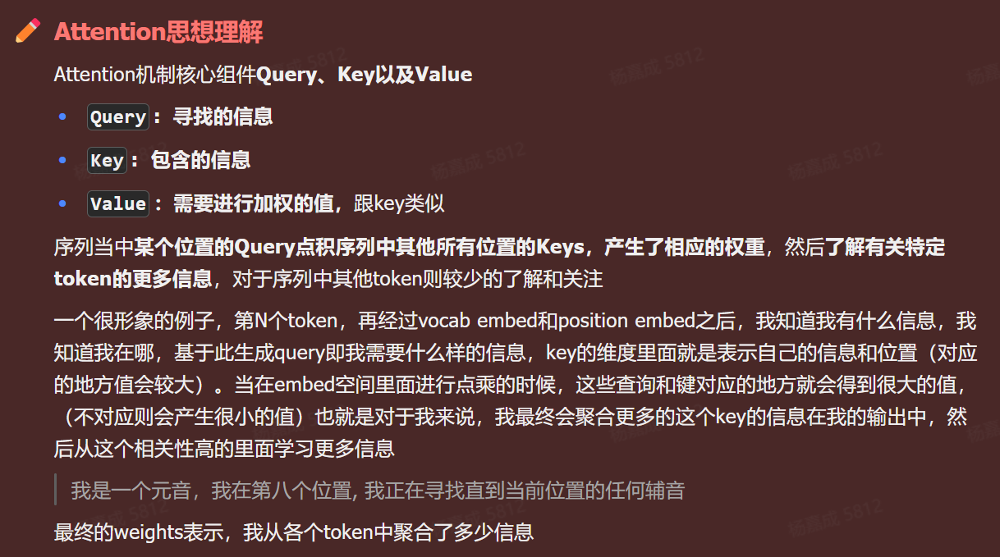

### ==Attention为什么要除以$\sqrt{d_k}$？==


## 1.3.2 Transformer中的Attention

### Encoder和Decoder中的Self-Attention

==QKV来自同样的原始序列的==， 只希望关注自己节点的互相交流的信息，查询、键和值都来自同一个输入序列。主要目的是**捕捉输入序列内部的依赖关系**。在Transformer的编码器（Encoder）和解码器（Decoder）的每一层都有自注意力，它允许输入序列的每个部分关注序列中的其他部分，区别在于：**Encoder中的self-attention是当前位置的token与序列全部token计算**，==Decoder中的self-attention是当前位置的token只与在他之前的token计算（Masked Attention/Casual Attention）==，为了避免解码过程中的信息泄漏

```sudo
1 获取输入的原始数据 X = input 
2 转换为Embedding并加上位置编码 X = emb(X) + pe(X) 
3 然后从X获取Q、K、V向量 Q, K, V = Qlinear(X) + Klinear(X) + Vlinear(X) 
4 计算Attention输出 Attention = softmax(QK^T / sqrt(d)) * V
```

### Decoder中的Cross-Attention：

==QKV来自不同的序列==，有一些其他的节点，我们希望把他们的信息融合到自己的节点上。**查询来自一个输入序列，而键和值来自另一个输入序列**。主要出现在Transformer的解码器。它允许解码器关注编码器的输出。**交叉注意力的思想是使一个序列能够“关注”另一个序列**。在许多场景中，这可能很有用，例如在机器翻译中，将输入序列（源语言）的部分与输出序列（目标语言）的部分对齐是有益的    

> 对于decoder来说，第一个attention模块是Masked Self-Attention，第二个则是 Cross-Attention模块     

```伪代码
1 获取输入的原始数据 X = input 
2 转换为Embedding并加上位置编码 X = emb(X) + pe(X) 
3 # KV：encoder_output，Q：X 
4 然后从X获取Q向量 Q= Qlinear(X)，KV则是直接从Encoder输出拿 
5 计算Attention输出 Attention = softmax(QK^T / sqrt(d)) * V
```

## 1.3.3 Attention计算复杂度的优化

Self Attention的时间复杂度是$O(N^2)$的，它要对序列中的任意两个向量都要计算相关度，得到一个$N^2$大小的相关度矩阵.

**Sparse Attention**

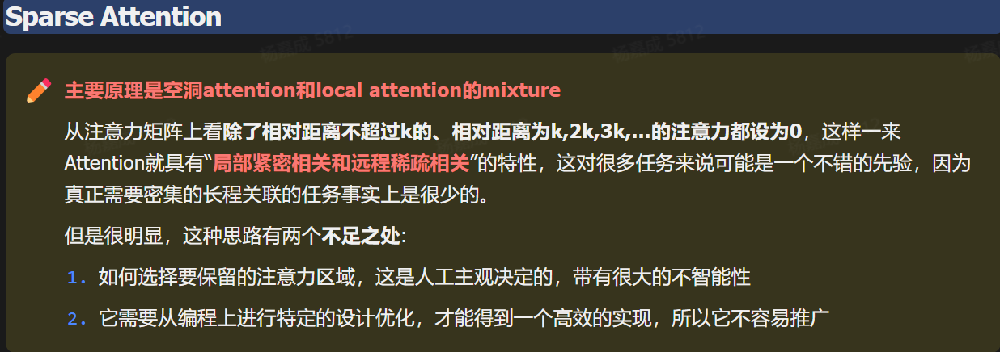

**Linear Attention**

**主要思想就是将softmax拿掉，然后先算K转置V，这样算法复杂度从$O(N^2d)$变为$O(Nd^2)$的接近线性**

## 1.3.4 KV Cache 键值缓存

### **一句话总结：**

k和v指的分别是`attention`机制中的`key`和`value`的状态值，`kv cache`只出现在transformer结构的自回归的`decoder`中，其是为了避免`scaled dot-product attention`过程中的重复计算。

### KV Cache 原理


### 优化方法


## 1.3.5 缓存与效果的取舍：MHA到MLA

#### 手撕代码（面到再看，已经下载了）


#### Multi-head Attention

原始transformer中的attention也是MHA，每一个head的head_size将变为原始embed_size的1/num_head，类似group卷积，类似于**建立了很多个交流通道**，每个交流通道关注的信息细节不一样，也就是**每一个头可以关注到序列中不同子空间的特征**。

#### Multi-query Attention

所有的query head 共享$KV$，MQA对KV Cache的压缩太严重，以至于会**影响模型的学习效率以及最终效果**。

#### Grouped-query Attention（带kv cache手撕）

**将query分成g组**，每组的query共享KV，平衡效果和缓存。

#### Multi-head Latent Attention

DeepseekV2提出的**优化MQA方法**，解决的核心问题是**使用kv cache时，随着序列长度变长导致显存不足的问题**    

•  参考：https://arxiv.org/pdf/2405.04434，【自然语言处理】【大模型】DeepSeek-V2论文解析_deepseek v2-CSDN博客    

•  具体工程实现参考：https://zhuanlan.zhihu.com/p/714761319

原理全是数学推导

<u>推理阶段：MLA变为MQA形式</u>

推理阶段的时候Q、K的Head Size变成了dc+dr，V的Head Size 则变成了dc，按照原论文的设置，这是dk、dv的4倍。所以实际上MLA在推理阶段做的这个转换，虽然能有效减少KV Cache，但其推理的计算量是增加的。**那为什么还能提高推理效率呢？**

我们可以将LLM的推理**分两部分**：第一个Token的生成（Prefill）和后续每个Token的生成（Generation），Prefill阶段涉及到对输入所有Token的并行计算，然后把对应的KV Cache存下来，这部分对于计算、带宽和显存都是瓶颈，MLA虽然增大了计算量，但KV Cache的减少也降低了显存和带宽的压力，大家半斤八两；==但是== Generation阶段由于每步只计算一个Token，实际上它更多的是带宽瓶颈和显存瓶颈，因此MLA的引入理论上能明显提高Generation的速度

## 1.3.6 DCA(Dual Chunk Attention)

论文：Training-Free Long-Context Scaling of Large Language Models    

链接：https://arxiv.org/pdf/2402.17463    

DCA的核心思想是将长文本分割成多个较小的“块”(chunks)，然后分别在这些块内和块之间应用注意力机制。具体步骤如下：   

​	◦  分块：将长文本分割成若干个小块，每个小块包含一部分文本。例如，一个2000词的文本可以分割成4个每块500词的小块   

​	◦  块内注意力：对每个小块单独应用注意力机制。这意味着每个块内的单词只与同一个块内的其他单词进行注意力计算，这样可以显著减少计算量    

​	◦  块间注意力：在计算完块内注意力后，再在这些块之间应用注意力机制。这意味着每个块会与其他块进行全局信息的交互，以捕捉整个文本的上下文关系

## 1.3.7 S2-Attention(Shifted Sparse Attention)

论文： LONGLORA: EFFICIENT FINE-TUNING OF LONG CONTEXT LARGE LANGUAGE MODELS    

链接：https://arxiv.org/pdf/2309.12307    

源码地址：https://github.com/dvlab-research/LongLoRA    

将上下文长度分成几个组，并在每个组中单独计算注意力。在半注意力头中，将token按半组大小进行移位，这保证了相邻组之间的信息流动。例如，使用组大小为2048的S2-Attn来近似总共8192个上下文长度训练    

1. 首先，它将沿头部维度的特征分成两大块 ( 比如8行4列，8行相当于8个token，4列可以认为是有4个头，然后竖着一切为二 )    
2. 其次，其中一个块中的标记被移动组大小的一半，**第2个part的第8个token的后一半表示(也即原始inputs第8个token的后两个heads)移动到第2个part的第1行，而第2个part中原来的「第1-7个token的后一半表示」整体往下移动一行**
3. 最后，将token分组并重塑为批量维度，注意力只在每个组内计算，信息通过移位在不同组之间流动。虽然移位可能会引入潜在的信息泄漏，但这可以通过对注意力掩码进行微调来避免

## 1.3.8 Gated Attention

论文：Gated Attention for Large Language Models: Non-linearity, Sparsity,  and Attention-Sink-Free    

链接：https://arxiv.org/pdf/2505.06708

这篇 Qwen 团队的 Gated Attention for Large Language Models: Non-linearity, Sparsity, and Attention-Sink-Free，本质上是在一个非常简单的地方动了一下手脚——**在标准 softmax 注意力的 SDPA 输出后加了一个 head-specific 的 sigmoid 门**


### 常见门控机制：LSTM/GRU

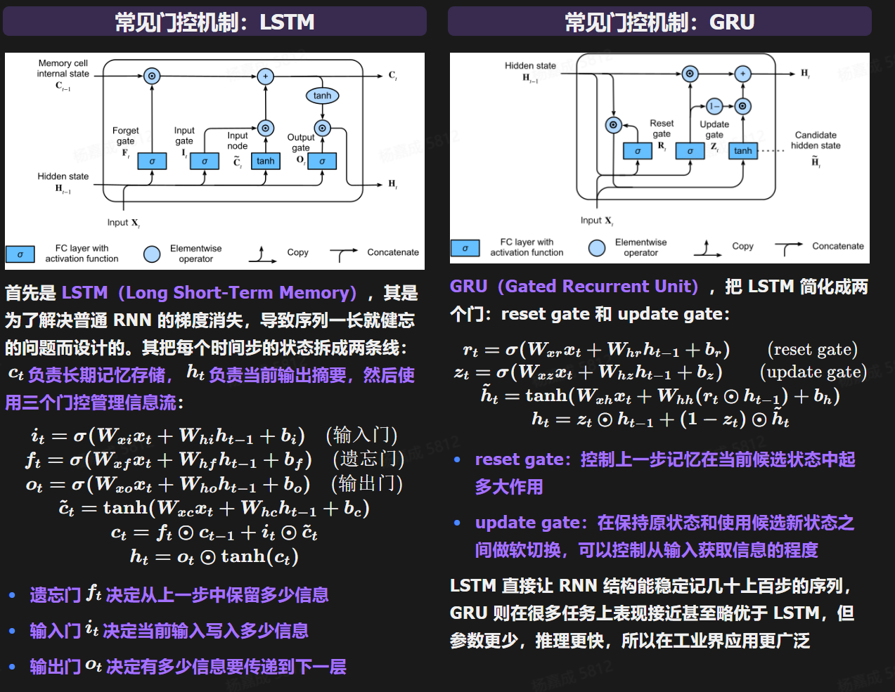

### 常见门控机制：SwiGLU(函数具体图像在1.4节)


#### 门控动机

**最有效的改动，就是在每个 attention head 的 SDPA（缩放scaled点积Dot product注意力）输出后，用当前 token 的 hidden state 算一个 sigmoid gate，做逐元素乘**

### 具体设计


### ==Gated Attention 总结==    

•  核心结论：在不改变 softmax、也不动主干结构的前提下，**在 SDPA 输出后加一个稀疏的、query-dependent、head-specific sigmoid gate，是提升 LLM 性能的高效方案：增强非线性表达力，抑制 massive activation，消灭 attention sink，并提升长上下文扩展和训练稳定性**   

•  局限：  

◦  1）没有深入分析非线性对注意力动态的影响    

◦  2）没有从理论上解释 attention sink 如何制约长上下文性能    

◦  3）只在1.7B/15B规模上进行了实验，没有验证超大规模模型（如 100B+）的门控效果     

**从长远的发展线来看，从 LSTM/GRU → Highway → SwiGLU → Mamba / GAU / Forgetting Transformer，到 Gated Attention，一条主线是：**     

> 现代深度网络越来越依赖显式门控来管理信息流和梯度流        

**G1 gated attention 可能会变成 SwiGLU 一样的默认组件，加在模型的 Attention 的结构中**


# <u>**Chap1.4 FFN & Add & LN 前馈层、残差、层归一化**</u>

## 1.4.1 三个模块的作用

### FFN 前馈层

Feed Forward Network，FFN    

过了MHA之后，tokens只是互相查看了一下信息，但是还没思考他们从其他token那里发现了什么。**所以当token通过MHA把信息聚集起来之后，再通过前馈网络独立的去思考学习这些信息，简而言之就是交流加计算**。

### Add 残差连接

Residual Add    

transformer结构一般会堆叠多个block，产生类似神经网络深度增加的优化问题。**残差链接**提供**梯度回传的高速公路，一开始残差块的影响比较小，这样梯度也可以很好的回传到输入，即使网络很深，随着训练继续，残差块的梯度逐渐扩大影响**。加法会平等的分散梯度。这样的话，至少在初始化的时候，梯度是可以很好的从监督信号回传到输入，从而避免因为很深的网络对优化的难度

### Layer Norm 层归一化    

**加速模型收敛，缓解梯度消失和爆炸问题**

#### ==Layer Norm和Batch Norm，注意二者的区别和应用场景==

**一般来说，Batch Norm适用于CV，Layer Norm适用于NLP**。关键是要看需要保留什么信息，举个例子就明白    

•  NLP中，`['搜推yyds', 'LLM大法好', 'CV永不为奴']`三句话做normalization，假设一个词是一个token，Batch Norm效果是`['搜', 'L', 'C']`, `['推', 'L', 'V']`` ...`做归一化；**Layer Norm是三句话分别各自归一化**；**前者归一到同一分布后变无法保留一个句子里的分布信息了**（比如`'搜推yyds'`用Batch Norm后就变了），**而Layer Norm可以成功保留上下文分布信息**    

•  【了解就行】CV中Batch Norm是对一个图像的不同channel（比如RGB通道）各自进行归一化，本身CV任务不需要channel之间的信息交互，归一化后仅保留各channel的分布信息作后续判断即可

- **BatchNorm**是对整个 batch 样本内的每个特征做归一化，这消除了不同特征之间的大小关系，但是保留了不同样本间的大小关系。BatchNorm 适用于 CV 领域，这时输入尺寸为 $b\times c \times h \times w$  (批量大小x通道x长x宽)，图像的每个通道 c 看作一个特征，BN 可以把各通道特征图的数量级调整到差不多，同时保持不同图片相同通道特征图间的相对大小关系
- 在train模式下参数会随着网络的反向传播进行梯度更新，计算每一个batch里的方差和平均值，在eval模式，模型不可能等到预测样本数量达到一个batch时，再进行归一化，而是直接使用train模式得到的统计量

#### 多种norm示意图


## 1.4.2 Layer Norm的位置和计算

### Norm出现在各个位置的影响    

•  Post-norm：深层容易出现**训练不稳定的情况**，深层的梯度范数逐渐增大    

•  Pre-norm：每层的梯度范数近似相等，**训练比较稳定，但是牺牲了深度**    

•  Sandwich-norm：平衡，有效控制每一层的激活值，避免它们过大，模型能够更好地学习数据特征，但是**训练不稳定可能导致崩溃**    

### ==•  Post-Norm和Pre- Norm的异同：==   

◦  一般认为，**Post-Norm在残差之后做归一化，对参数正则化的效果更强，进而模型的收敛性也会更好；而Pre-Norm有一部分参数直接加在了后面，没有对这部分参数进行正则化，可以在反向时防止梯度爆炸或者梯度消失**，大模型的训练难度大，因而==使用Pre-Norm较多==。目前比较明确的结论是：**==同一设置之下，Pre-Norm结构往往更容易训练，但最终效果通常不如Post Norm==**。一个𝐿层的Pre Norm模型，其**实际等效层数不如𝐿层的Post Norm模型**，而层数少了导致效果变差了    

◦  Pre-Norm结构**无形地增加了模型的宽度而降低了模型的深度**，而深度通常比宽度更重要，所以是无形之中的降低深度导致最终效果变差了。而Post-Norm刚刚相反，它每Norm一次就削弱一次恒等分支的权重，所以Post Norm反而是更突出残差分支的，因此Post-Norm中一旦训练好之后效果更优，但是因为残差支路被削弱了，所以一开始不好训练，需要**warmup**    

◦  Post norm的**不稳定性主要来自于梯度消失**，以及初始化时候更新太大陷入**局部最优**    

◦  输入经过了Norm之后，基本上能保持同一量级，然后Attention、MLP这些运算，一般不会大幅改动输入数值的量级（否则容易梯度消失或者爆炸），因此输出的范围也大致相同

### Layer Norm的计算

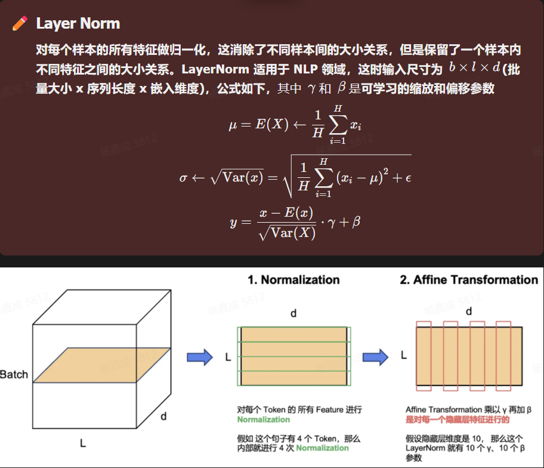

代码详见文档

### RMS NORM

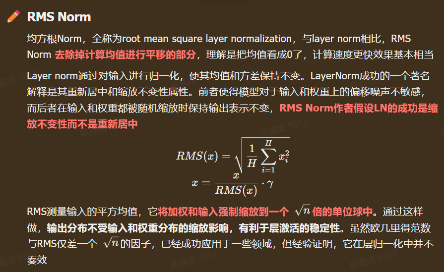

### Deep Norm    

**可以缓解 Transformer 过深导致爆炸式模型更新训练不稳定的问题，把模型更新限制在常数，使得模型训练过程更稳定。**Deep Norm方法在执行Layer Norm之前，up-scale了残差连接(alpha>1)另外，在初始化阶段down-scale了模型参数(beta<1)

具体推导见文档

## 1.4.4 FFN计算和激活函数

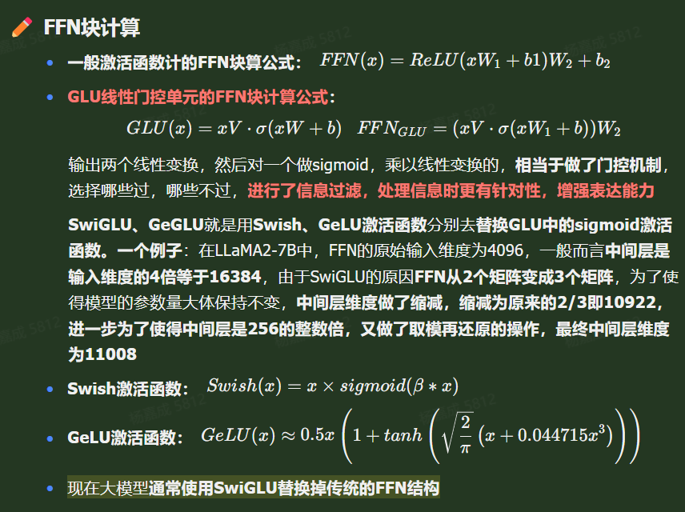

**现在大模型通常使用SwiGLU替换掉传统的FFN结构**

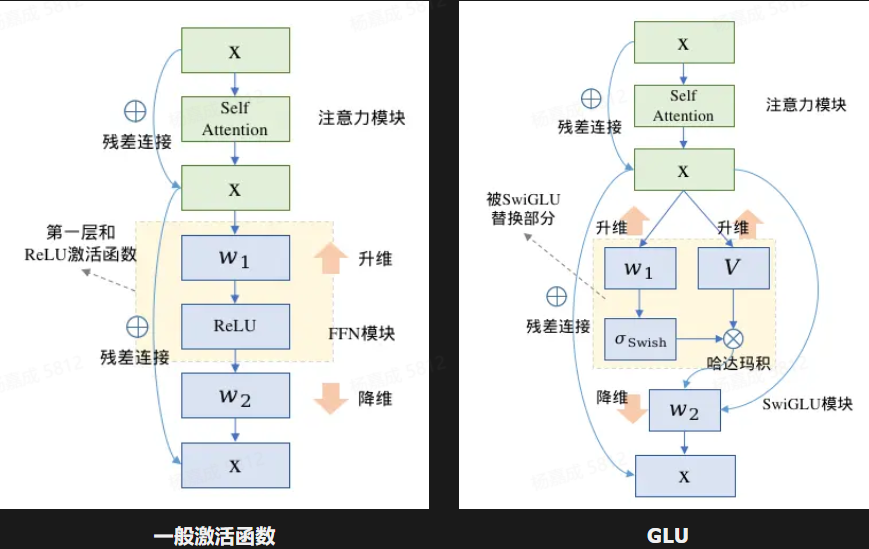

## 1.4.5 常见激活函数公式及图示

#### Sigmoid,Tanh,ReLU,Leaky ReLU简单，见文档

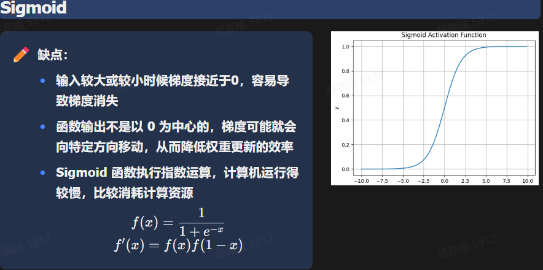

- Tanh 0中心,存在梯度饱和的问题

- ReLU 解决了梯度消失的问题，当输入值为正时，神经元不会饱和。当输入为负时，梯度为0。这个神经元及之后的神经元梯度永远为0，不再对任何数据有所响应，导致相应参数永远不会被更新，+SGD快速收敛（随机梯度下降）
- $$ \text{ReLU}(x) = \max(0, x) $$
- Leaky ReLU解决了ReLU输入值为负时神经元出现的死亡的问题，函数中的α，需要通过先验知识人工赋值
- $$ \text{LeakyReLU}(x) = \max(\alpha x, x) $$

#### ELU

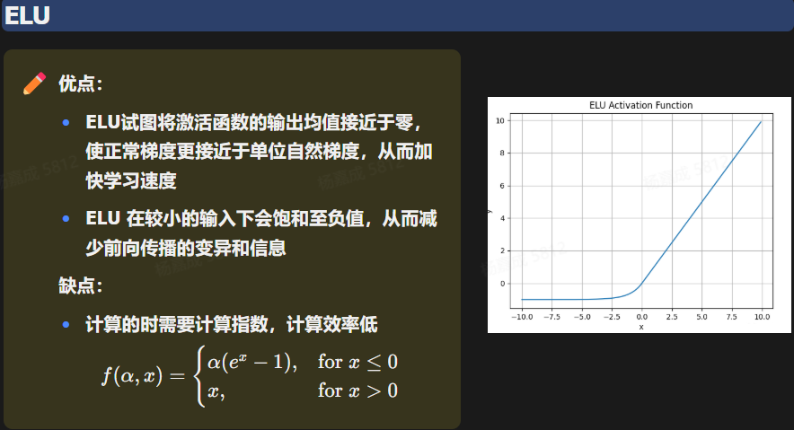

#### <u>Swish</u>


#### SiLU

##### 核心特点

- **平滑可导**：全程连续可微，无 ReLU 的 “死神经元”（负区梯度为 0）问题。
- **负区有梯度**：负输入不截断，保留微弱信号，利于梯度传播。
- **正区近线性**：x 很大时接近 x，无饱和、梯度不衰减。
- **非单调**：负区间先降后升，增强模型表达力。

##### 对比 ReLU

- 比 ReLU**更平滑、负区有梯度**，训练更稳、收敛更好。
- 计算略贵，但 GPU 优化后开销可忽略。

#### Softmax


# <u>Chap1.5 Positional Encoding 位置编码</u>

## 位置编码的需求

RNN的结构包含了序列的时序信息，而Transformer却完全把时序信息给丢掉了，比如“他欠我100万”，和“我欠他100万”，两者的意思千差万别，**故为了解决时序的问题**，Transformer的作者用了一个绝妙的办法：位置编码(Positional Encoding)

Attention计算是无向的，而各种位置信息在tokens间的关系是很重要的。对于人来说很容易知道tokens的位置信息，比如：    

•  **绝对位置信息**，a1是第一个token，a2是第二个token......     

•  **相对位置信息**，a2在a1的后面一位，a4在a2的后面两位......    

•  **不同位置间的距离**，a1和a3差两个位置，a1和a4差三个位置....    

<u>因此，我们需要这样一种位置表示方式，满足于：</u>    

•  它能用来表示一个token在序列中的**绝对位置**    

•  在序列长度不同的情况下，**不同序列中token的相对位置/距离也要保持一致**    

•  可以用来表示模型在训练过程中从来**没有看到过的句子长度**（==**长度外推问题**==）    

需要一个**有界又连续**的函数，最简单的，正弦函数sin就可以满足这一点。

## 1.5.2 绝对位置编码

### Transformer的位置编码

**Transformer的位置编码加在embedding上**，但是由于使用的是**sin cos 交替**，可以通过==线性变换矩阵得到其他位置的表示==，所以可以期望他包含了**相对位置的信息**，而且由于**三角函数有显示的生成规律，所以可以期望有外推性质**

**Transformer位置编码**的**缺点**：由于**位置编码点积的无向性**，即两个位置编码的乘积仅取决于$\Delta T$     ，距离是成对分布的，不能用来表示位置的方向性。当随着input embedding被喂入attention的时候会出现**距离意识被破坏的现象**，即**正弦位置编码的相对位置表达能力被投影矩阵破坏掉了**，所以在后续BERT的改进中，采用了可学习的位置编码。

### BERT的可学习位置编码

直接将==**位置编码当作可训练参数**==，比如最大长度为512，编码维度为768，那么就初始化一个512×768的矩阵作为位置向量，让它随着训练过程更新。对于这种训练式的绝对位置编码，一般的认为它的==**缺点是没有长度外推性**==，即如果预训练最大长度为512的话，那么最多就只能处理长度为512的句子，再长就处理不了了。当然，也可以将超过512的位置向量随机初始化，然后继续微调

> **BERT 位置编码就是一组和词向量维度相同、可被梯度更新的参数，用来告诉模型每个 token 在句子里排第几。**

### RNN 位置编码

递归式的绝对位置编码，input后面接一层RNN，可以用RNN学每个位置的位置编码。**优点是外推、灵活，缺点是丧失transformed的并行处理性质**

## 1.5.3 相对位置编码

相对位置表示数学推导见文档。

对 Attention 公式中的 query 和 key 列向量进行拆分，\(x_i\)、\(p_i\) 分别为输入 embedding 和位置编码，\(W_Q\)、\(W_K\) 分别为 query 和 key 的投影矩阵，同时展开 output 部分，\(W_V\) 为 value 的投影矩阵：

**二元相对位置向量只依赖于相对位置，而且通常会进行截断处理**，这样只需要有限个位置编码（不管是三角函数式还是训练式），<u>都可以表达出任意长度的相对位置</u>
$$
R_{i,j}^K = p_K\left[ \text{clip}(i-j, p_{\min}, p_{\max}) \right] \\
 R_{i,j}^V = p_V\left[ \text{clip}(i-j, p_{\min}, p_{\max}) \right]
$$

### XLNET式的位置编码

也是数学推导

论文链接：https://arxiv.org/pdf/1901.02860

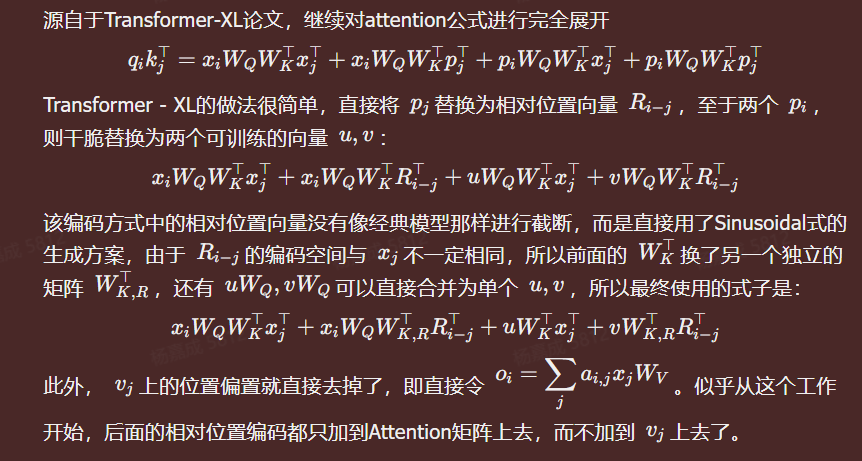

### T5式的位置编码

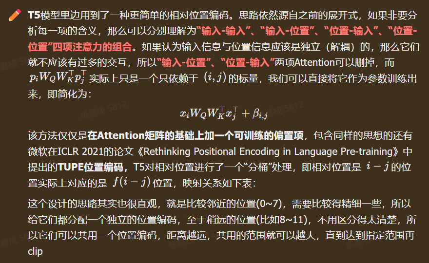

### DeBERTa的位置编码（直接过了）

## 1.5.4 RoPE和ALiBi

### ==RoPE==

**旋转式位置编码 Rotary Position Embedding**，通过==**绝对位置编码的方式实现相对位置编码**==，综合了绝对位置编码和相对位置编码的优点。主要就是==对attention中的q, k向量注入了绝对位置信息，然后用更新的q,k向量做attention中的内积就会引入相对位置信息了==。**RoPE广泛应用在目前的大模型生态中**。


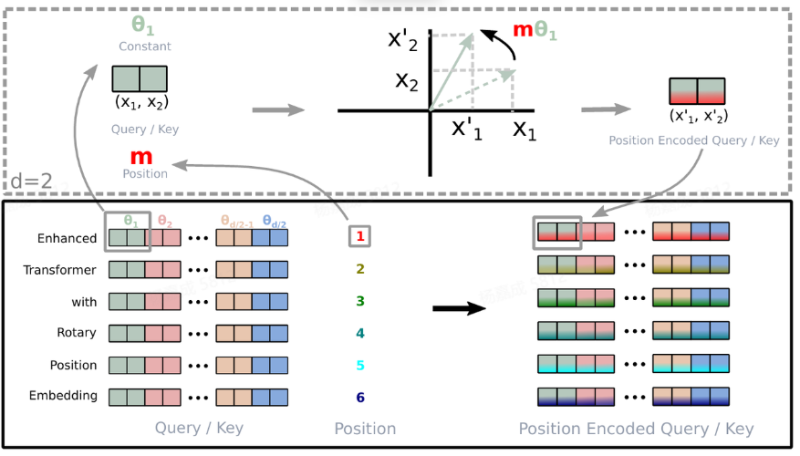

#### ==RoPE的问题==    

**直接外推会出现比较大的Attention Score**    

RoPE（相对位置编码）使用正弦和余弦函数将位置信息嵌入到词汇向量的旋转矩阵中。然而，由于以下原因，**RoPE直接外推会导致Attention Score显著增加**：    

•  **正弦和余弦函数的周期性**：   

​	◦  正弦和余弦函数是周期性的，周期为$2\pi$，在训练数据中，位置通常在一个相对较小的范围内（例如，0到512或0到2048），这些位置的编码值会保持在周期的某一部    

​	◦  当位置超出这个范围时（例如，位置变为3000或3500），编码值会进入正弦和余弦函数的另一个周期。由于这些函数的周期性，**这些位置的编码值可能与训练数据中的编码值非常不同，导致模型在计算注意力分数时出现剧烈变化**     

•  **高频成分的影响**：   

​	◦  在RoPE编码中，较高维度的编码（即频率较高的正弦和余弦成分）会对**较大的位置变化更加敏感，这意味着，随着位置数值的增加，这些高频成分会迅速变化**    

​	◦  对于**较大的位置值**，**正弦和余弦函数的值可能会经历快速变化**，这种快速变化会导致Attention机制中query和key的点积（即Attention Score）出现显著波动、

[引出位置内插](#positional-interpolation-位置内插)
[跳转到位置内插](#positional-interpolation-位置内插)（Ctrl按住跳转）

### ALiBi

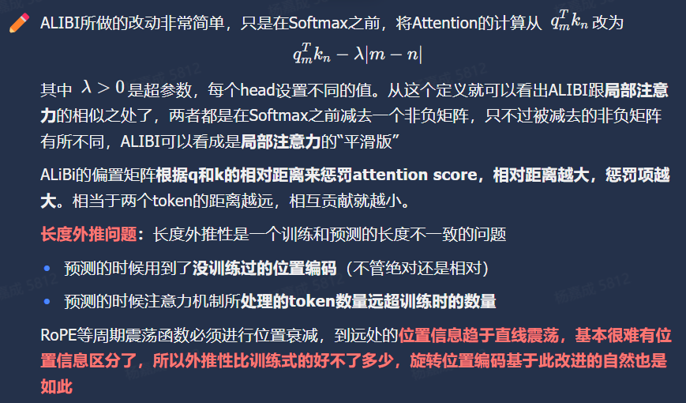

## 1.5.5 长度外推优化

#### 进制表示到直接外推

所以解决方案就是提前预留多几维，训练阶段设为0，推理阶段改为其他数字，这就是**外推Extrapolation**。但是推理阶段改为其他数字，因为模型对没被训练过的情况不一定具有适应能力，所以==直接进行外推通常会导致模型的性能严重下降==

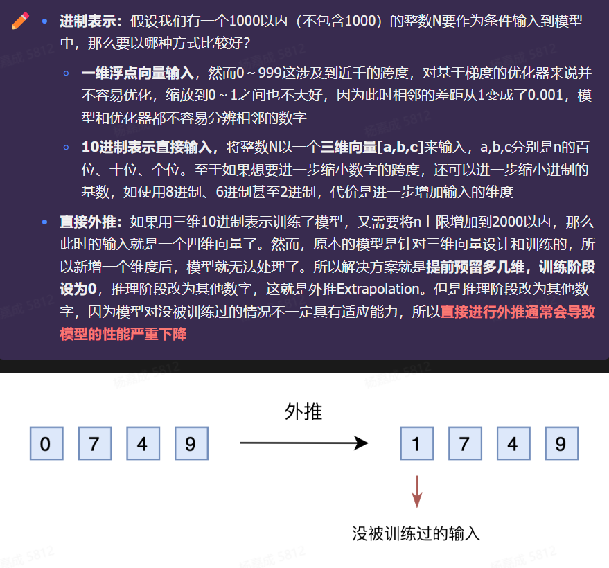

#### 线性内插到进制转换

**内插Interpolation**后需要微调训练，以便模型**重新适应拥挤的映射关系**

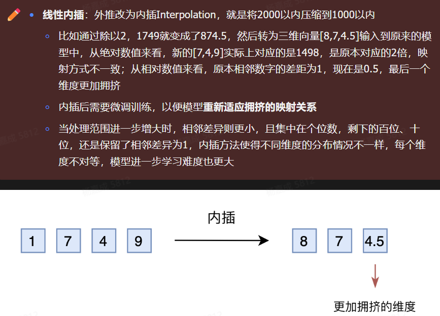

**进制转换**：不用新增维度，又能保持相邻差距


### Positional Interpolation 位置内插

语言模型通常是用**固定的上下文长度进行预训练的**，如何通过在**==相对较少的数据量上进行微调来扩展上下文长度，位置插值将上下文长度扩展到预训练极限之外==**

**关键思想**：不进行外推，而是**直接将位置索引减小，使得最大位置索引与目标长度大小**，**即预训练阶段的先前上下文窗口限制相匹配**。可以在相邻的整数位置上插值位置编码，毕竟位置编码可以应用在非整数的位置上(而非在训练位置之外 进行外推)。

下图所示，如果直接使用位置(2048,4096]进行推理，那么因为模型没有见过这一部分的位置，效果会出现灾难性的下降，就把[0,4096]这个区间压缩到[0,2048]，原先的1就变成了0.5，4096就变成了2048，这就是**位置内插法**，**即把没见过的位置映射到见过的位置**


（指标为困惑度，越低越好，对下一个单词预测越准确）

### NTK-aware 插值到 Dynamic NTK插值

**NTK-aware插值**：核心思想 ==高频外推，低频内插==，不像PI针对所有维度平均缩放，而是减少对高频区域的缩放和增加对低频区域的缩放，从而将插值压力分散到多个维度

​	**缺点**：一些维度被轻微外推到超出边界的值，因此使用NTK-aware插值进行微调的结果有可能不如PI；此外，由于存在“越界”值，理论尺度因子s并不能准确描述真实的上下文扩展尺度。在实践中，对于给定的上下文长度扩展，尺度值s必须设置得高于预期尺度

**NTK-by-parts 插值**：考虑了波长于上下文的关系

**描述**：有一些维数的波长长于预训练期间看到的最大上下文长度$\lambda > L$，这表明一些维数的嵌入可能在旋转域中不均匀分布。**当波长很长时，这些维度上的嵌入几乎不变，可以认为它们==保持了绝对位置信息==**，即每个位置的嵌入不因相对位置变化而变化；**当波长较短时**，**嵌入会在较短的距离内完成多次旋转，这使得这些维度上的嵌入反映的是相对位置信息**，即它们可以==**捕捉到标记之间的相对距离变化**==

​	**缺点一长串**：波长有关······ 用比例s去对所有维度进行缩放的时候，所有tokens都变得更彼此接近，同样的位移对应的旋转角度变化减小，向量指向更加相似的方向，**这种缩放严重损害了LLM理解其内部嵌入之间的小型和局部关系的能力**，导致模型在邻近标记的位置顺序上被混淆，从而损害模型的能力

**解决办法：数学**


（过了）**Dynamic NTK 插值**：动态调整缩放因子$s$

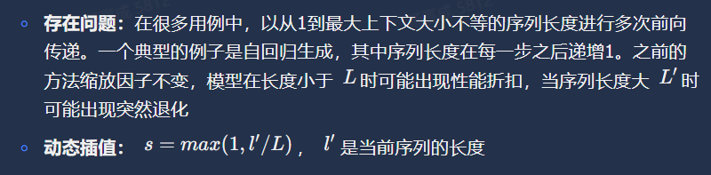

### YaRN (Yet another RoPE extensioN method)

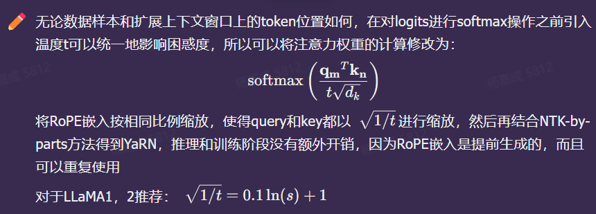

##### ==DOUBAO总结==

##### 1. 核心思想：用温度 `t` 控制注意力的 “锐度”

在标准的 Scaled Dot-Product Attention 中，注意力权重是这样计算的：

$$softmax\left(\frac{QK^\top}{\sqrt{d_k}}\right)$$

这里引入了一个**温度系数 `t`**，把公式修改为：

$$ \text{softmax}\left(\frac{QK^\top}{t\sqrt{d_k}}\right) $$

- 当 `t > 1` 时，logits 被 “拉平”，softmax 输出的概率分布更平滑，模型对不同位置的注意力更分散。
- 当 `t < 1` 时，logits 被 “锐化”，softmax 输出的概率分布更集中，模型更关注少数几个位置。

这个 `t` 就像一个 “温度旋钮”，统一调节了模型对上下文的困惑度（perplexity）。

------

##### 2. RoPE 缩放与 YaRN 方法

为了在不重新训练的情况下扩展 LLM 的上下文窗口，研究者们提出了多种方法，这里提到的 **YaRN** 是其中一种高效的方案：

1. **RoPE 缩放**：将 RoPE（旋转位置编码）按比例 `√(1/t)` 进行缩放，使得 query 和 key 向量都按这个比例被缩放。这相当于在频域上对位置编码进行了调整。
2. **NTK-by-parts**：结合 NTK（神经正切核）理论，通过分块的方式来处理不同频率的位置编码，使得模型在扩展到更长上下文时，依然能保持良好的性能。
3. **高效推理**：YaRN 的优势在于，RoPE 嵌入是**提前生成**并可以重复使用的，因此在推理和训练阶段都不会产生额外的计算开销。

------

##### 3. LLaMA-2 的简化公式：一个经验结论

你看到的公式：

$\sqrt{1/t} = 0.1 \ln(s) + 1 $

这里的 `s` 代表上下文窗口的**缩放倍数**（例如，从 4k 扩展到 32k，`s = 8`）。

这个公式并不是从理论上严格推导出来的，而是 Meta 团队在对 LLaMA-2 模型进行大量实验后，总结出的一个**经验性结论**。它的作用是：

- 给定一个目标上下文窗口缩放倍数 `s`，可以直接计算出需要的温度缩放系数 `t`。
- 这个简化公式让工程实现变得非常方便，不需要复杂的理论计算，直接代入即可。

例如，如果我们想把 LLaMA-2 的上下文窗口从 4k 扩展到 8k（即 `s = 2`）：

$1/t=0.1ln(2)+1≈0.1×0.693+1=1.0693$

然后我们就可以算出 `t`，并代入到注意力公式中进行缩放。

------

##### 总结

这段内容的核心是：

- **温度 `t`** 是控制注意力分布的关键参数。
- **YaRN** 是一种高效的上下文窗口扩展方法，它通过缩放 RoPE 和结合 NTK 理论来实现。
- LLaMA-2 的公式是一个**经验简化**，目的是为了方便工程实践，而不是理论上的 “变简单了”。

------

# 1.6 Structure & Decoding 结构和解码

## 1.6.1 大模型结构

首先回顾 Transformer 的结构如下所示，**主要分为编码器 Encoder 和解码器 Decoder 两部分，且都是多层叠加**

•**Encoder： **  ==MHA + FFN + LN&Add，采用双向注意力机制，前后的token都能看到==

•**Decoder：**先是 **Masked MHA + LN&Add ** ==**单向注意力，当前token只能看到自己之前的token，防止未来信息泄露，预测下一个token只能利用之前的信息**==，然后接上 **Cross MHA**（Encoder-Decoder Attention Layer），**通过编码器输出的上下文信息来关注解码器这里的序列的相关部分，最后解码器生成与输入匹配的输出序列**

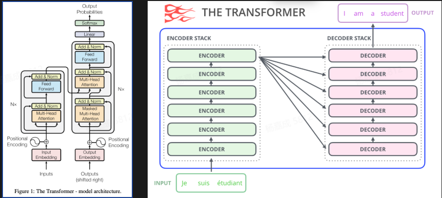

## Dense Model 稠密模型

**Dense 模型**是相对 MoE（混合专家来说的），一般常见的模型大部分都是稠密参数模型，**每次推理都会激活全部的参数**

**MoE（Mixture of Experts，混合专家模型）** 是一种**稀疏激活**的 AI 架构，核心是 “**分而治之、按需激活**”。

##### > 核心结构（3 个关键组件）

1. **专家（Experts）**：多个独立的小型子网络（通常是 FFN），各自专精某类任务 / 数据（如代码、数学、翻译）。
2. **门控网络（Gating Network）**：“智能路由器”，对输入打分，选出**Top-K 个最匹配的专家**激活。
3. **加权聚合**：按门控权重融合选中专家的输出，得到最终结果。

[详细内容](#moe-model-混合专家模型)

### LLM的四种结构

LLM的结构可以分为四种：**Decoder-only、Encoder-only、Encoder-Decoder、Prefix LM**(可以看成特殊的Encoder-Decoder)

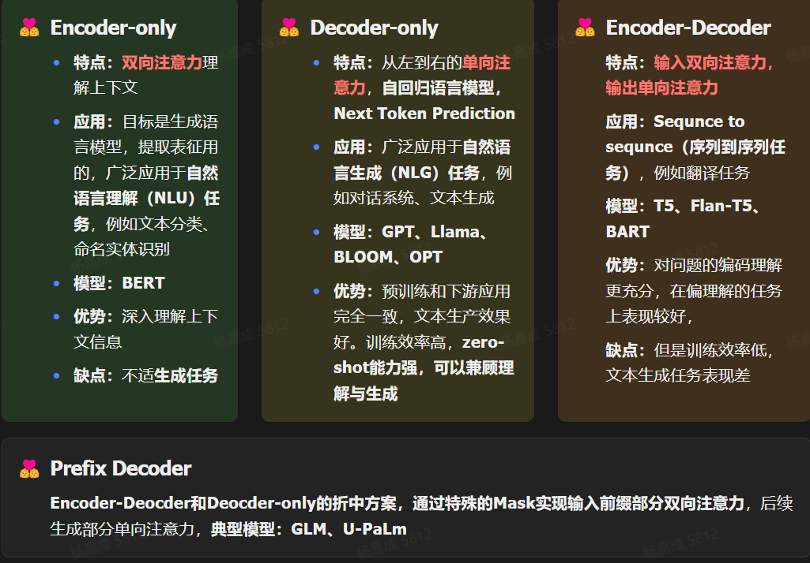

#### ==选择Decoder-only的原因==

以Next Token Prediction范式为基础，利用prompt转换可以实现多种任务、问题的统一训练，且适应于长度变化的文本生成

##### 1. 上半部分：Encoder-Decoder 架构

- Encoder（编码器）

  - 输入：源语言句子，例如英文 `He is eating an apple`。
  - 作用：将整个源句子编码成一个上下文向量（context vector），捕捉源语言的完整语义。

- Decoder（解码器）

  - 输入：目标语言的前缀，例如 `<s> 他 在 吃 苹 果`（`<s>` 是句子开始标记）。

  - 输出：逐个生成目标语言的下一个词，直到生成句子结束标记 `</s>`。

  - 特点：

    - 训练时需要 “源语言 + 目标语言” 的平行语料对。
    - 推理时，Encoder 处理源语言，Decoder 从 `<s>` 开始自回归生成译文。

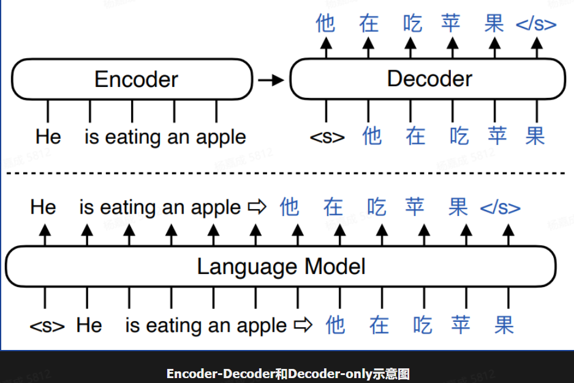

##### 2. 下半部分：Decoder-only 架构

这是当前大语言模型（如 GPT、LLaMA）的主流结构，本质是一个**自回归语言模型**

(<u>自回归语言模型，简单说就是：</u>
**按顺序一个词一个词地生成文本，每次只预测下一个词。**)。

- Language Model（语言模型）

  - 输入：将源语言和目标语言拼接成一个序列，例如 `<s> He is eating an apple ⇨ 他 在 吃 苹 果`。
  - 输出：预测序列中的下一个 token。在翻译任务中，模型会在看到 `He is eating an apple ⇨` 后，继续生成 `他 在 吃 苹 果 </s>`。
  - 特点：
    - 训练时只需要大量单语文本，也可以通过 “指令微调”（Instruction Tuning）来做翻译。
    - 推理时，直接把 “源语言 + 分隔符” 作为前缀，让模型自回归生成目标语言，无需单独的 Encoder。

## MoE Model 混合专家模型

MoE（Mixture of Experts）混合专家    

参考链接：https://newsletter.maartengrootendorst.com/p/a-visual-guide-to-mixture-of-experts    

混合专家（MoE）是一种利用多个不同的子模型（专家）来提升LLM质量的技术。**每个混合专家（MoE）层的组成形式通常是 𝑁 个「专家网络」{𝑓_1, ... , 𝑓_𝑁} 搭配一个「门控网络」G**。

**MoE 层的放置位置是在 Transformer 模块内，作用是选取前向网络（FFN），通常位于自注意力子层之后**。<u>这种放置方式很关键，因为随着模型增大，FFN 的计算需求也会增加</u>。

举个例子，在参数量达到 5400 亿的 PaLM 模型中，90% 的参数都位于其 FFN 层中    

•  **专家 Expert**：每个前馈神经网络（FFN）层都有一组“专家”，可以选择其中的一部分。这些“专家”通常也是FFN    

•  **路由或门控网络 Router/Gate**：这个门控网络的形式通常是一个使用 softmax 激活函数的线性网络，其作用是将输入引导至合适的专家网络，也就是决定哪些token发送到哪些专家    

**典型模型**：Deepseek V2/V3、Mistral 8x7B

> 需要注意的是，“专家”并不专注于特定领域，如“心理学”或“生物学”。专家在学习过程中最多只能掌握关于单词层面的句法信息，更具体地说，**专家的专长是在特定上下文中处理特定token**

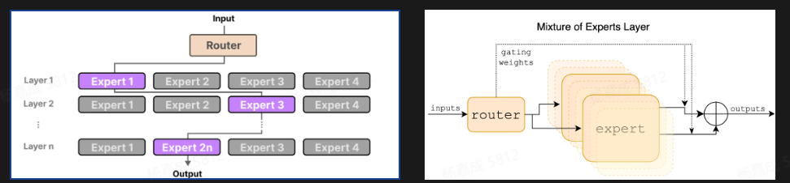


密集层和稀疏层


#### Decoder MoE


### 专家架构    

•  专家通常是**完整的FFN块**    

•  LLM有多个Decoder Block，给定的文本在**生成之前会经过多个专家**

•  **选择的专家可能因token而异，产生不同的路径**

详细图例见文档

### 路由机制

**路由器Router**    

在专家层之前添加一个路由Router（也称为门控网络Gate），专门**训练用来选择针对特定token的专家**。路由（或门控网络）也是一个**FFN**，可以输出概率，选择最匹配的专家。专家层**返回所选专家的输出，乘以门控值（选择概率）**，<u>路由与专家共同构成**MoE层**</u>

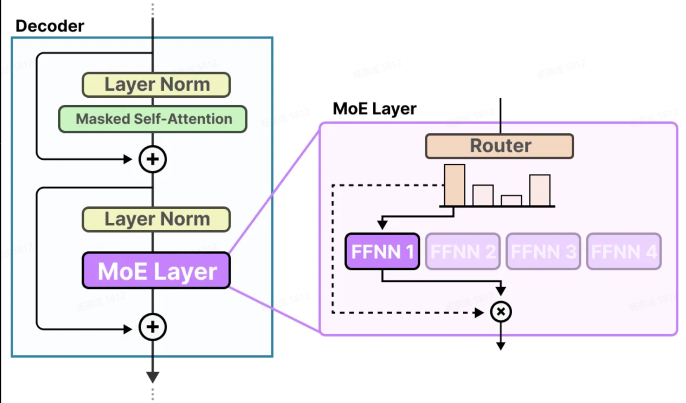


#### MoE层的类型    

•  稀疏混合专家：稀疏MoE仅选择少数专家    

•  **密集混合专家**：密集MoE则选择所有专家，但可能在不同的分布中。目前常见的MoE模型通常指的是稀疏MoE，这在计算上更为经济

#### 路由函数的种类    

根据对每个输入的处理方法，Router（Gate）可分为三种类型：**稀疏式、密集式和 soft 式**。其中前两种上面讲到了，**soft 式则包括完全可微方法，包括输入 token 融合和专家融合**

#### ==专家的选择==   

**Router**（门控网络Gate）不仅决定**推理期间选择哪些专家，还决定训练时的选择**    

1. 输入 $x$ 乘以路由权重矩阵 $W$ 得到输出$ H(x)  $  
2. 然后对输出应用**SoftMax**，创建每个专家的概率分布$G(x)$  
3. **Router**使用这个概率分布来选择最匹配的专家 
4. 最后将**每个路由的输出与每个选定的专家相乘，并将结果相加**

#### 路由的复杂性    

然而，这个简单的函数通常**导致路由器选择相同的专家**，因为某些专家可能学习得比其他专家更快。

这不仅会导致**选择的专家分布不均，而且一些专家几乎无法受到训练。这在训练和推理期间都会产生问题**    

相反，我们希望在**训练和推理期间让专家之间保持均等的重要性**，这称为==负载均衡==。这样可以<u>防止对同一专家的过度拟合</u>

#### ==负载均衡==

KeepTopK 论文来的： OUTRAGEOUSLY LARGE NEURAL NETWORKS:  THE SPARSELY-GATED MIXTURE-OF-EXPERTS LAYER    链接：https://arxiv.org/pdf/1701.06538

**KeepTopK** **扩展通过引入可训练的（高斯）噪声，可以避免重复选择相同的专家**。除了想要激活的前k个专家之外，其余专家的权重将被设置为-∞。通过将这些权重设置为-∞，这些权重上的SoftMax输出所产生的概率将会是0。KeepTopK 也可以在不添加额外噪声的情况下使用

KeepTopK 策略将每个 token 路由到少数选定的专家。这种方法称为 ==**Token Choice**==，它允许将给定的词元发送给一个专家（top-1路由），或者发送给多个专家（top-k路由）。一个**主要的好处是它允许权衡和整合专家各自的贡献**

##### 辅助损失 Auxiliary Loss    

为了在训练期间使专家的分布更加均匀，辅助损失（也称为负载均衡损失）会被添加到常规损失中。它增加了一个约束条件，迫使专家具有同等的重要性    

辅助损失的第一个组成部分是**对整个批次中每个专家的路由值进行求和**，得到每个专家的**重要性得分**，它代表了在任何输入下，给定专家被选中的可能性。可以用这个来计算**变异系数（CV）**，表示专家之间的重要性得分有多大差异：

$$ \text{CoefficientVariation(CV)} = \frac{\text{standard deviation}(\sigma)}{\text{mean}(\mu)} $$

•  例如，如果重要性得分有很大差异，变异系数就会很高    

•  相反，**如果所有专家的重要性得分相似，变异系数就会很低（这是我们的目标）**    

利用变异系数得分可以在训练期间更新辅助损失，使其==**目标是尽可能降低变异系数得分（从而给予每个专家同等的重要性）**==，最后辅助损失被单独添加进来，作为一个独立的损失项在训练期间进行优化

#### 专家容量

##### Token分布的不平衡    

**不平衡现象不仅存在于被选中的专家中，还存在于发送给专家的token分布中**    

例如，<u>如果输入的token在分配给不同专家时比例失调，过多地发送给一个专家而较少地发送给另一个专家，那么可能会出现训练不足的问题。</u>问题不仅仅在于使用了哪些专家，还在于对它们的使用程度    

一个解决方案是**限制给定专家可以处理的token数量，即专家容量**。当一位专家达到其容量时，后续的token 将被发送给下一位专家。如果所有专家都达到了他们的容量，那么该token将不会被任何专家处理，而是被发送到下一层。这被称为**token溢出（token overflow）**

#### Switch Transformer

**简化 MoE**，核心是把标准稀疏 MoE 的**Top‑K 路由**简化为**Top‑1 路由**（每个 token 只选 1 个专家），大幅降低路由计算、通信与实现复杂度，同时保留稀疏激活的核心优势。

###### 核心定义

简化 MoE（典型如**Switch Transformer**）：在 Transformer 的 MoE 层中，**门控网络为每个 token 仅路由到 1 个专家**（k=1），而非标准 MoE 的 2–4 个。

#### MoE激活参数    

混合专家在给定时间只使用一部分专家，所以可以访问比实际使用更多的参数。虽然**给定混合专家模型有更多的参数要加载（稀疏参数），但在推理期间只使用一些专家，所以激活的参数较少（活跃参数）**。虽然仍然需要将整个模型（包括所有专家）加载到设备上（稀疏参数），但进行推理时只需要使用一部分（活跃参数）。混合专家模型需要更多的显存（VRAM）来加载所有专家，但在推理期间运行得更快

**以Mixtral 8x7B 为例，可以看到每个专家的大小是5.6B，而不是7B（尽管有8个专家）。加载8×5.6B（46.7B）的参数（以及所有共享参数），但在推理时我们只需要使用2×5.6B（12.8B）的参数。**


##### ==还有好多图，没看懂，问到再看。==

## 1.6.2 解码采样策略

大模型在输出token的时候的几种解码策略（以下都是豆包）

1. **大模型很多确实是 decoder-only（如 GPT、Llama）**，但这里的 **decoder 是模型结构**，不是 “解码策略” 里的解码。
2. **解码策略 = 怎么从模型输出的概率分布里选下一个 token**，跟模型是 encoder/decoder 结构无关。

### ==为什么 decoder-only 模型还要 “解码”？==

先分清两个完全不同的 “解码”：

#### ① 模型结构里的 Decoder

Transformer 结构分两种：

- **Encoder-only**：BERT、RoBERTa（理解类，做分类、抽取）
- **Decoder-only**：GPT、Llama、Qwen 等生成式大模型
- **Encoder-Decoder**：T5、BART（翻译、摘要）

这里的 **Decoder** 是：

- 带**自注意力掩码**，只能看前面的 token
- 专门做**自回归生成**：一个个字往下猜

#### ② 生成时的 Decoding Strategy（解码策略）

模型每一步输出的不是 “一个字”，而是：

> **所有 token 的概率分布：p (token₁, token₂, ..., tokenₙ)**

**解码 = 从这个概率分布里，选出下一个 token**
所以：
**Decoder-only 模型 ≠ 不需要解码**
反而**最依赖解码策略**，因为它是逐词生成。

### Greedy Search

贪心的**每次选择概率最大的token（词）**，简单高效，但是**可能会导致生成的文本过于单调和重复**

### Beam Search（束搜索）

**维护一个大小为 k 的候选序列集合**，每一步从每个候选序列的概率分布中选择概率最高的 k 个单词，然后保留总概率最高的 k 个候选序列。这种方法可以平衡生成的质量和多样性，但是可能会导致**生成的文本过于保守和不自然**

每一步保留 **top-k 条候选序列**

最后选**整体概率最高**的一条

适合**翻译、摘要**等需要准确、通顺的任务

**缺点**：不适合开放对话，容易呆板、重复

### Random Sampling（随机采样）

直接按概率随机抽，不是只选最大的。

下面是它的**变种**：

#### Top-K Sampling

- 只在 **概率前 K 个 token** 里随机采样
- K 越小越确定，越大越多样

**从排名前 k 的 token 中进行抽样**，允许其他分数或概率较高的token 也有机会被选中。在很多情况下，这种抽样带来的随机性有助于提高生成质量。但是将采样池限制为固定大小 K 可能会在**分布比较尖锐的时候产生胡言乱语**，而在**分布比较平坦的时候限制模型的创造力**

#### Top-P (Nucleus) Sampling（最常用）

- 选**概率累加 ≥ P** 的最小集合
- 动态调整候选集
- 对话、创作常用，**自然不呆板**

在**累积概率超过设定值P的最小单词集中采样**

#### Temperature（温度系数）

- 不是选法，是**调节概率分布**
- T ↓ 概率更尖锐 → 更确定
- T ↑ 概率更平滑 → 更随机、更有创意

加在Softmax上的温度系数，用来调节大模型输出token的概率分布的平坦程度，**越大概率分布越平坦，输出越随机，越小概率分布越极端，输出越稳定**

#### KPT 联合采样

联合采样**（top-k & top-p & Temperature）** ，先后进行 **top-k->top-p->Temperature** **采样**    

根据 top-k，保留概率最高的 k 个 token，接下来，使用 top-p 保留概率的累计和达到 p 的单词，接着使用 Temperature 进行归一化，最后可以从剩下的分布中进行随机采样，选取一个 token 作为最终的生成结果

#### Best-of-N

通过让大模型输出N个回答，然后通过不论是Verifier、ORM（结果奖励模型）还是PRM（过程奖励模型，PRM可以给出步骤奖励加权和作为整个回答的分数）给出每个回答的分数，然后**选择其中最高的（Best）作为最后的回答**

#### Majority Vote & Self-consistency

**Majority Vote 多数投票**：输出多个回答，选择答案一致性最多的作为最终答案 

**Self-consistency 自一致性**：最早出现在论文 SELF-CONSISTENCY IMPROVES CHAIN OF THOUGHT REASONING IN LANGUAGE MODELS 中，通过让大模型输出多个CoT推理路径，得到多个答案，然后通过多数投票的方式选出最终答案，做法类似于多数投票

